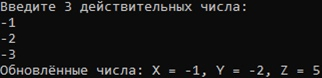
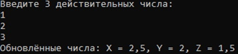
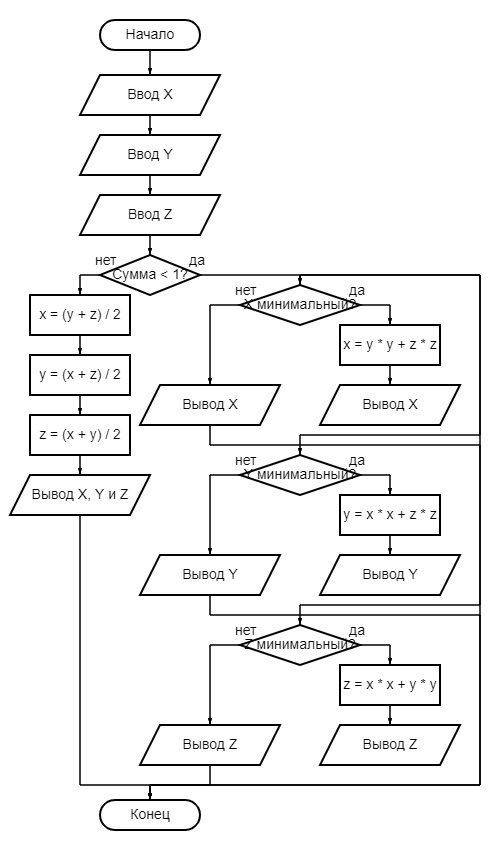
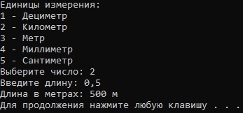
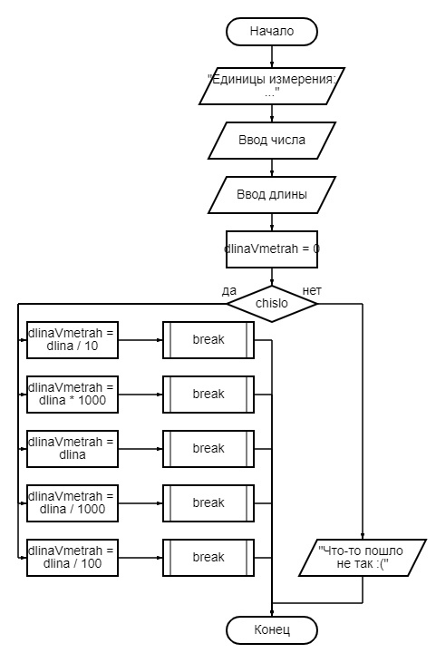

# Лабораторная работа 3
**1.** Даны действительные числа X, Y, Z. Если сумма чисел меньше 1, то наименьшее из них заменить суммой квадратов двух других. В противном случае значения X, Y, Z заменить полусуммой двух других.
____

Рис. 1 - вывод программы

Рис. 2 - вывод программы

Рис. 3 - блок-схема
____
**2.** По введённому номеру единицы измерения (1 - дециметр, 2 - километр, 3 - метр, 4 - миллиметр, 5 - сантиметр) и длине отрезка L получить соответствующее значение длины отрезка в метрах.
____

Рис. 4 - вывод программы

Рис. 5 - блок-схема